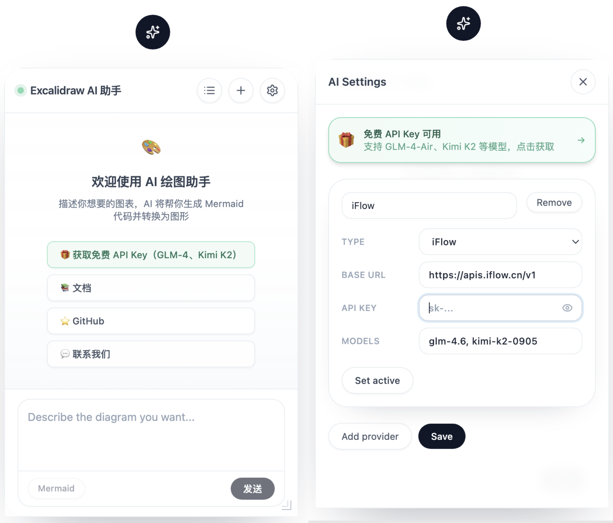
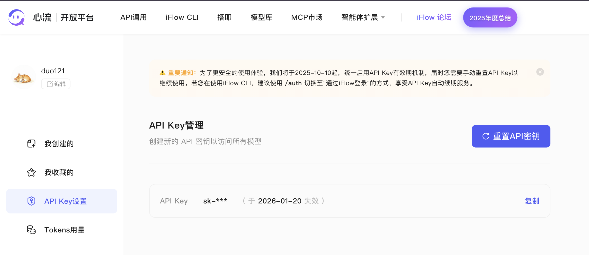

# AGNX Excalidraw

[English](./README.md) | [中文](./README.zh-CN.md)

一个基于 [Excalidraw](https://excalidraw.com/) 的 AI 增强白板应用，支持 Mermaid 图表转换和多种 AI 模型集成。

[](https://vercel.com/new/clone?repository-url=https://github.com/duo121/agnx-excalidraw)

## 📸 界面预览



## ✨ 效果展示


## 🔗 相关链接

| 链接 | 说明 |
|------|------|
| 🌐 [在线演示](https://agnx-excalidraw.vercel.app/) | 立即体验 AGNX Excalidraw |
| 📚 [文档站点](https://agnx-excalidraw-docs.vercel.app/) | 详细文档和 API 参考 |
| 💻 [GitHub 仓库](https://github.com/duo121/agnx-excalidraw) | 源代码和 Issue |

## 🎁 免费 AI 模型

**没有 API 密钥也能用！** 项目集成了心流平台的免费模型：

- **GLM-4-Air** - 智谱 AI 出品，中文理解能力强
- **Kimi K2** - 月之暗面最新模型，推理能力出色

🔗 获取免费 API Key：https://platform.iflow.cn/profile?tab=apiKey



## ✨ 特性

- 🎨 **Excalidraw 画布** - 完整的 Excalidraw 绘图功能
- 🤖 **AI 对话** - 支持多种 AI 模型（OpenAI、Anthropic、Gemini、心流免费模型等）
- 📊 **Mermaid 支持** - 自动将 Mermaid 代码转换为 Excalidraw 图形
- 💾 **本地存储** - 自动保存图表到浏览器本地存储
- 🌙 **深色模式** - 支持亮色/深色主题切换
- 🚀 **一键部署** - 支持 Vercel 一键部署

## 🚀 快速开始

### 环境要求

- Node.js >= 18.0.0
- pnpm（推荐）或 npm

### 安装

```bash
# 克隆项目
git clone https://github.com/duo121/agnx-excalidraw.git
cd agnx-excalidraw

# 安装依赖
pnpm install

# 启动开发服务器
pnpm dev
```

### 环境变量配置

在项目根目录创建 `.env` 或 `.env.local` 文件：

```env
# AI 模型配置（至少配置一个）
OPENAI_API_KEY=your_openai_api_key
ANTHROPIC_API_KEY=your_anthropic_api_key
GEMINI_API_KEY=your_gemini_api_key
DEEPSEEK_API_KEY=your_deepseek_api_key

# 可选：自定义模型配置
VITE_PROVIDER_TYPE=openai
VITE_BASE_URL=https://api.openai.com/v1
VITE_MODEL=gpt-4o-mini
```

### 构建与部署

```bash
# 构建生产版本
pnpm build

# 预览构建结果
pnpm preview
```

## 📚 使用指南

### AI 对话

1. 点击右侧工具栏的 AI 图标打开 AI 面板
2. 在输入框输入你的需求，例如："画一个用户登录流程图"
3. AI 会自动生成 Mermaid 代码并转换为 Excalidraw 图形

### Mermaid 模式

1. 在 AI 面板中选择 "Mermaid" 模式
2. 直接输入或让 AI 生成 Mermaid 代码
3. 点击 "转换" 将代码转换为图形

支持的 Mermaid 图表类型：
- 流程图 (flowchart)
- 时序图 (sequenceDiagram)
- 类图 (classDiagram)
- 状态图 (stateDiagram)
- 实体关系图 (erDiagram)
- 甘特图 (gantt)

## 🔧 配置说明

### 支持的 AI 模型提供商

| 提供商 | 环境变量 | 默认模型 |
|--------|----------|----------|
| OpenAI | `OPENAI_API_KEY` | gpt-4o-mini |
| Anthropic | `ANTHROPIC_API_KEY` | claude-3-sonnet |
| Google Gemini | `GEMINI_API_KEY` | gemini-pro |
| DeepSeek | `DEEPSEEK_API_KEY` | deepseek-chat |
| 心流（免费） | 在设置中配置 | glm-4-air, kimi-k2 |

🆓 **免费选项**：从 https://platform.iflow.cn/profile?tab=apiKey 获取免费 API Key

### Vite 环境变量

- `VITE_` 前缀的环境变量会暴露给客户端
- 生产环境构建时，`*_API_KEY` 不会被注入（安全考虑）

## 🚀 部署到 Vercel

### 一键部署

点击下方按钮快速部署到 Vercel：

[](https://vercel.com/new/clone?repository-url=https://github.com/duo121/agnx-excalidraw)

### 手动部署

1. Fork 此仓库到你的 GitHub 账号
2. 在 [Vercel](https://vercel.com) 中导入项目
3. 配置环境变量（在 Vercel 控制台中设置）
4. 部署完成！

## 🛠️ 开发

### 开发命令

```bash
pnpm dev        # 启动开发服务器
pnpm typecheck  # 类型检查
pnpm build      # 构建
pnpm preview    # 预览构建结果
```

### 技术栈

- **框架**: React 19 + TypeScript
- **构建**: Vite 7
- **样式**: Tailwind CSS
- **画布**: Excalidraw
- **图表**: Mermaid
- **路由**: React Router DOM

## 🤝 贡献指南

欢迎贡献！请参阅 [CONTRIBUTING.md](./docs/CONTRIBUTING.md) 了解详情。

1. Fork 项目
2. 创建功能分支 (`git checkout -b feature/amazing-feature`)
3. 提交更改 (`git commit -m 'Add some amazing feature'`)
4. 推送到分支 (`git push origin feature/amazing-feature`)
5. 创建 Pull Request

## 📄 许可证

本项目采用 MIT 许可证 - 详见 [LICENSE](./LICENSE) 文件。

## 🙏 致谢

- [Excalidraw](https://excalidraw.com/) - 优秀的手绘风格白板工具
- [Mermaid](https://mermaid.js.org/) - 基于文本的图表生成工具
- [Vercel](https://vercel.com/) - 优秀的部署平台

## 📬 联系我

如果你有任何问题或建议，欢迎通过以下方式联系我：

- 🐛 提交 [GitHub Issue](https://github.com/duo121/agnx-excalidraw/issues)
- 💬 添加微信交流


