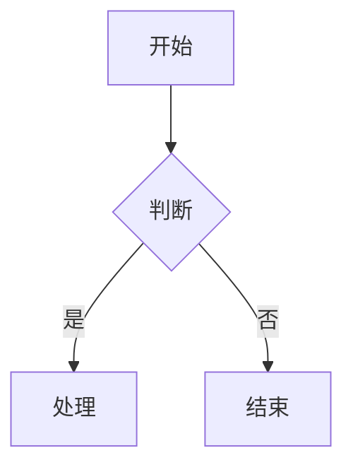
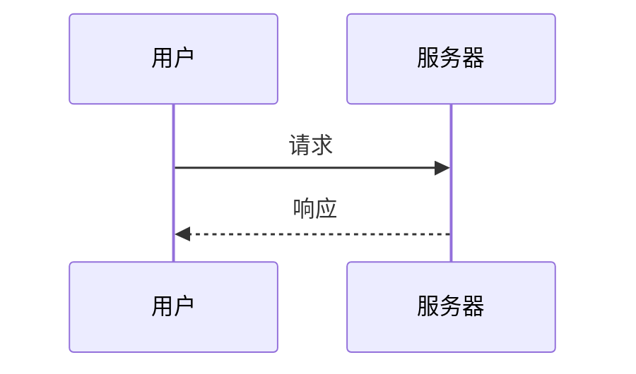
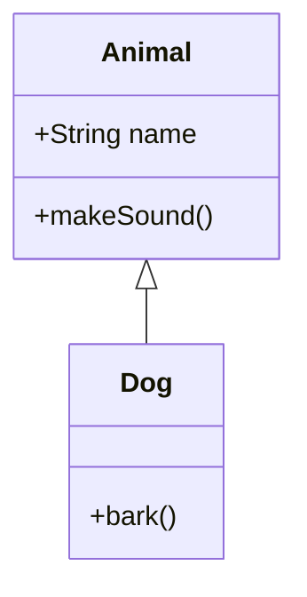
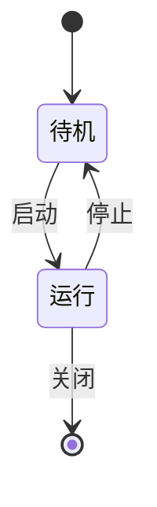
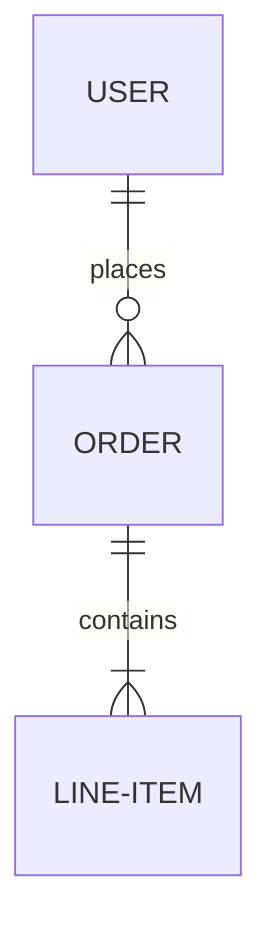
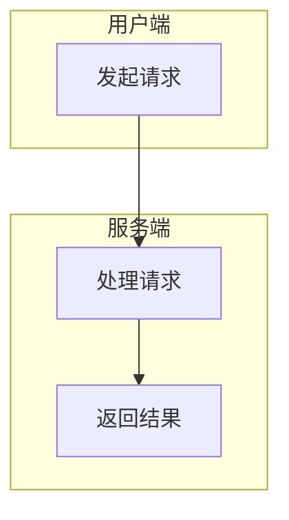
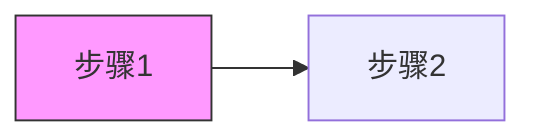

# Mermaid 支持

AGNX Excalidraw 支持将 Mermaid 代码自动转换为 Excalidraw 图形。

## 支持的图表类型

### 流程图 (Flowchart)



### 时序图 (Sequence Diagram)



### 类图 (Class Diagram)



### 状态图 (State Diagram)



### 实体关系图 (ER Diagram)



## 使用方法

### 方法一：AI 生成

1. 打开 Mermaid 面板
2. 输入描述，如 "用户注册流程"
3. AI 自动生成 Mermaid 代码
4. 点击「转换」应用到画布

### 方法二：直接编写

1. 在 Mermaid 面板中编写代码
2. 点击「转换」按钮
3. 图形自动渲染到画布

### 方法三：SDK 调用

```typescript
import { convertMermaidToExcalidraw } from './sdk';

const mermaidCode = `
flowchart TD
    A[开始] --> B[结束]
`;

const sceneData = await convertMermaidToExcalidraw(mermaidCode, {
  isDark: false,  // 主题
});

// 应用到 Excalidraw
excalidrawAPI.updateScene({
  elements: sceneData.elements,
});
```

## 转换选项

### 主题适配

```typescript
// 浅色主题
await convertMermaidToExcalidraw(code, { isDark: false });

// 深色主题
await convertMermaidToExcalidraw(code, { isDark: true });
```

### 自定义样式

```typescript
await convertMermaidToExcalidraw(code, {
  preferredStrokeColor: '#1971c2',  // 边框颜色
});
```

## 注意事项

### 1. 语法要求

- 使用标准 Mermaid 语法
- 节点 ID 不要包含特殊字符
- 中文内容需要用方括号包裹

### 2. 转换限制

- 部分高级 Mermaid 特性可能不支持
- 复杂布局可能需要手动调整
- 建议节点数量控制在 20 个以内

### 3. 性能优化

大型图表转换可能较慢，建议：

```typescript
// 使用 loading 状态
setLoading(true);
try {
  await convertMermaidToExcalidraw(code);
} finally {
  setLoading(false);
}
```

## 最佳实践

### 流程图技巧



### 样式优化



## 常见问题

### Q: 为什么有些图表无法转换？

A: 请检查 Mermaid 语法是否正确，可以先在 [Mermaid Live Editor](https://mermaid.live) 验证。

### Q: 如何调整生成的图形位置？

A: 转换后可以使用 Excalidraw 的选择工具拖拽调整，或使用 DSL 编辑功能批量调整。

### Q: 支持自定义节点形状吗？

A: 目前支持基本形状（矩形、菱形、圆形），更多形状正在开发中。
