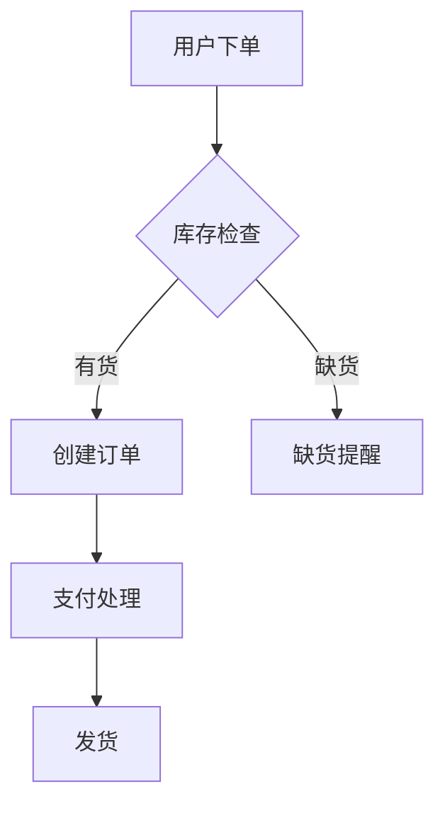

# 快速上手

5 分钟快速了解 AGNX Excalidraw 的核心功能。

## 基本界面

启动应用后，你会看到以下界面：

- **左侧工具栏** - Excalidraw 原生绘图工具
- **中央画布** - 主绘图区域
- **右侧 AI 面板** - AI 功能入口

## 功能一：AI 生成 Mermaid 图表

### 步骤

1. 点击右侧 AI 图标打开面板
2. 选择 "Mermaid" 模式
3. 输入描述，例如："用户登录流程"
4. 点击发送，AI 会生成 Mermaid 代码
5. 点击 "转换" 将代码转为图形

### 示例

```
输入：电商订单处理流程
```

AI 会生成类似以下的 Mermaid 代码：



## 功能二：DSL 编辑

DSL 编辑允许你用自然语言修改画布上的元素。

### 步骤

1. 在画布上创建一些图形
2. 切换到 "DSL" 模式
3. 输入编辑指令，例如："将所有矩形的背景改为蓝色"
4. AI 会解析指令并更新画布

### 常用指令示例

- "将标题字体放大到 24px"
- "把第一个节点向右移动 100 像素"
- "添加一个红色箭头连接节点 A 和 B"
- "删除所有虚线"

## 功能三：直接绘图

当然，你也可以使用 Excalidraw 的原生绘图功能：

- **矩形/椭圆/菱形** - 创建基本形状
- **箭头/线条** - 连接元素
- **文本** - 添加标签和说明
- **手绘** - 自由绘图

## 快捷键

| 快捷键 | 功能 |
|--------|------|
| `V` | 选择工具 |
| `R` | 矩形 |
| `O` | 椭圆 |
| `A` | 箭头 |
| `T` | 文本 |
| `Ctrl+Z` | 撤销 |
| `Ctrl+Shift+Z` | 重做 |
| `Ctrl+A` | 全选 |

## 保存与导出

- **自动保存** - 图表自动保存到浏览器本地存储
- **导出 PNG** - 点击菜单导出为图片
- **导出 JSON** - 保存为 Excalidraw JSON 格式

## 下一步

- [配置指南](/docs/getting-started/configuration) - 了解更多配置选项
- [AI 集成](/docs/concepts/ai-integration) - 深入了解 AI 功能
- [API 文档](/docs/api/overview) - 开发者参考
